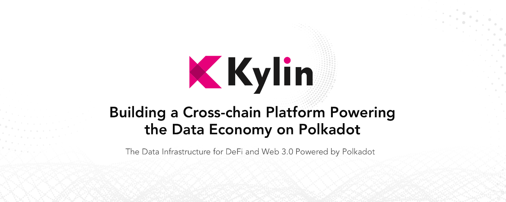

 

# Hi there 👨‍🚀

I'm a Full Stack Software Engineer working in US. I like to try out new technologies and currently learning things to transform myself into blockchain developer. Currently learning solidity and rust.

## About me

- Blockchain Enthusiast
- Polkadot and [Kylin](https://kylin.network/) Lover
- Reach me to collaborate on any new projects 
- I like to read technical books specially related to blockchain technologies
- 🌱 I’m currently learning **[Solidity](https://soliditylang.org/) and [Rust](https://www.rust-lang.org/)
- 👯 I’m looking to collaborate on **new and exciting projects**
- I am also cloud lover and worked on all the major cloud platforms (AWS, Azure and Google Cloud)

 

## 🔨Languages, Tools & Tech 👷

These are languages, tools, and technologies I either use at work or enjoy using on my own time.

    
    
    
    
       
       
    
    
    

 
 
 

## Statistics

